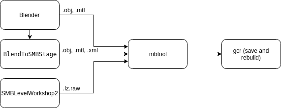

# mbreplacer

**PLEASE READ SECTIONS INSTALLATION AND RUNTIME DEPENDENCIES BEFORE USING THE TOOL**

This is a tool meant for speeding up the process of using multiple people's tools
for importing custom monkeyball stages into the game.

The inputs and usage of this tool in the entire process is as follows:



## Installation
### Normal people - download and run
Should work on any python enabled OS. 

Normal people can just download mbreplacer executable for their OS here:
https://github.com/ackhoury/mbreplacer/releases

### Cool people - run with python3
python3.5 dependencies: `PyQt5==5.12.2`
```bash
sudo pip3 install PyQt5==5.12.2
```

Then you can just straight run mbreplacer.py
```bash
python3 mbreplacer.py
```

### Even Cooler people - build from scratch
python3.5 dependencies: `PyQt5==5.12.2, cx_Freeze==5.1.1`
```bash
sudo pip3 install PyQt5==5.12.2 cx_Freeze==5.1.1
```
You can build the executable for your OS using:
```bash
python3 setup.py build
```
Your executable will be found in the generated `build/` folder

## Runtime Dependencies
mbreplacer requires:
- BobJrSenior's `SMB_LZ_Tool.exe`: [SMB LZ Tool](https://bobjrsenior.pw/smb/smblztool/SMB_LZ_Tool.zip)
- BobJrSenior's `GxModelViewer.exe`: [GxModelViewerNoGUI](https://bobjrsenior.pw/smb/gxmodelviewer/GxModelViewerNoGUI.zip)
- CraftedCart's `ws2lzfrontend.exe`: [SMB Workshop Tool 2](https://bintray.com/craftedcart/the-workshop/smblevelworkshop2-beta/v1.0.0-beta.1)

Please put the contents for these tools somewhere in the mbreplacer directory. 
mbreplacer will automatically find and import them

## Pre-steps
1. Create your stage in some 3d modeling software like Blender or Wings3D
2. Export stage as .obj file (will also export a needed .mtl)
2.1 Note if you are using the [BlendToSMBStage](https://gitlab.com/CraftedCart/BlendToSMBStage) 
then you will need to export the config (.xml) file, and skip step 3.
3. Use [SMB Level Workshop Tool 2](https://bintray.com/craftedcart/the-workshop/smblevelworkshop2-beta/v1.0.0-beta.1) to create a .lz.raw
for your stage.

_The mbreplacer will take in an .obj, .mtl, and any of (.xml, .lz.raw, .lz) as valid inputs
for replacing a stage._

**mbreplacer: (.obj, .mtl, (.xml, .lz.raw, .lz)) -> (.gma, .tpl, .lz)**

mbreplacer will look in the same directory as the .obj file for the other associated files. It will assume all files have the same name:

an example organization for your stages:
```
stages_folder/
    stage1/
        stage1.obj
        stage1.mtl
        stage1.xml
    stage2/
        stage2.obj
        stage2.mtl
        stage2.lz.raw
    stage3/
        stage3.obj
        stage3.mtl
        stage3.lz
```
as long as all the supporting files are in the same directory as the obj, 
it wont be picky how you organize your files.

**Once you have this, you can use mbreplacer!**

## Using mbreplacer

1. import the root folder exported from [gamecube rebuilder](https://www.romhacking.net/utilities/619/)
2. import the stages using the `+` button to import a single stage, 
or `import stages folder` button to recursively import all stages within a directory (it looks for .obj files)
3. select the stage you wish to use in the list on the left, then click the `>>` button to add it the the queue for replacement.
4. a popup will arise asking you which stage you would like to replace (only shows challenge mode for now)
5. you will see the stages meant for replacement in the list on the right, when you are happy with it, click the `replace` button to
replace the stages in the root folder given.

Note that if multiple stages are selected, and the `>>` button is pressed, it will query the location of
the first stage in the list, and populate the rest sequentially after this.

## Post-steps
After you have done this, you should be able to open the root in [gamecube rebuilder](https://www.romhacking.net/utilities/619/)
and save and rebuild the iso, and play it!

Happy MB hacking!
